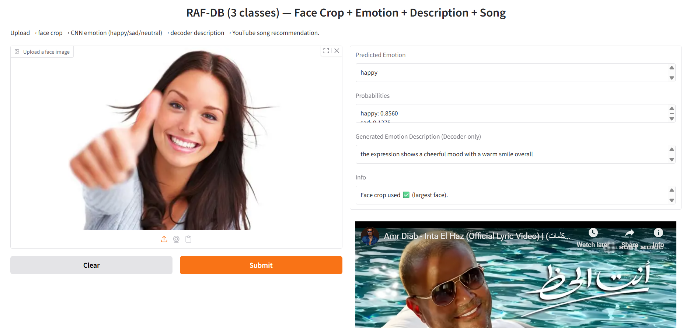

# Music Mood Recommendation System
### Facial Emotion Recognition with Description and Song Recommendation

---

## Project Description

This project presents an **end-to-end facial emotion analysis system** that performs emotion recognition from facial images, generates a short natural-language description of the detected emotion, and recommends emotion-based songs or media through an interactive web interface.

The system is designed for **academic and educational purposes** and demonstrates the integration of **computer vision**, **deep learning**, **sequence modeling**, and **human-centered AI interfaces** within a unified application.

---
## System Interface

The following figure illustrates the complete system workflow, including face upload, emotion prediction with probability scores, emotion description generation using a GRU decoder, and emotion-based song recommendation through an embedded media player.



---
## Table of Contents

* Project Overview
* Features
* System Pipeline
* Model Architecture
* Dataset
* Song Recommendation Logic
* Technologies Used
* Installation
* Running the Project
* Project Structure
* Example Output
* License
* Acknowledgments

---

## Project Overview

Given a facial image as input, the system produces:

* A predicted emotion label (Happy, Sad, or Neutral)
* Confidence probabilities for each emotion class
* A generated textual description of the detected emotion
* An emotion-based song or media recommendation

All components are integrated into a **single interactive Gradio web application**, providing a complete user-facing AI system.

---

## Features

* Facial emotion recognition from static images
* CNN-based emotion classification
* GRU-based emotion description generation
* Emotion-driven song or media recommendation
* Automatic face detection and cropping using OpenCV
* Interactive web interface using Gradio

---

## System Pipeline

```
Image Input
   ↓
Face Detection (OpenCV Haar Cascade)
   ↓
CNN Emotion Classifier
   ↓
Emotion Prediction + Probabilities
   ↓
GRU-Based Text Decoder
   ↓
Emotion Description
   ↓
Emotion-Based Song / Media Recommendation
```

---

## Model Architecture

### 1. CNN Emotion Classifier

* **Input:** 48 × 48 grayscale facial image
* **Architecture:**

  * Convolutional layers with ReLU activation
  * Max-pooling and dropout layers for regularization
  * Dense embedding layer with 256 units
  * Softmax output layer with three classes
* **Output:**

  * Probability distribution over emotion classes
  * Final predicted emotion label

**Emotion Classes:**

* Happy
* Sad
* Neutral

The CNN learns hierarchical facial representations ranging from low-level edges to high-level expression-specific features.

---

### 2. GRU-Based Emotion Description Generator

* **Model Type:** Recurrent Neural Network (RNN)
* **Decoder Architecture:** Gated Recurrent Unit (GRU)
* **Text Processing:** Keras `TextVectorization` layer
* **Generation Method:** Autoregressive token-by-token decoding

**Inputs:**

* Predicted emotion class ID
* Previously generated tokens

**Output:**

* A short natural-language sentence describing the detected emotion

The decoder is **emotion-conditioned**, meaning it generates text based on the predicted emotion class rather than direct visual embeddings.

---

## Dataset

* **Dataset Name:** RAF-DB (Real-world Affective Faces Database)
* **Source:** Kaggle
* **Link:**
  [https://www.kaggle.com/datasets/shuvoalok/raf-db-dataset](https://www.kaggle.com/datasets/shuvoalok/raf-db-dataset)

### Selected Emotion Classes

| RAF Label | Emotion |
| --------- | ------- |
| 4         | Happy   |
| 5         | Sad     |
| 7         | Neutral |

### Preprocessing Steps

* Filtering selected emotion classes
* Dataset restructuring
* Train / validation / test splitting
* Class balancing via down-sampling
* Grayscale image conversion
* Image resizing to 48 × 48 pixels

---

## Song Recommendation Logic

* Each emotion class is mapped to a predefined set of song or media recommendations
* After emotion prediction, a recommendation corresponding to the detected emotion is selected
* Recommended content is displayed directly within the Gradio interface (e.g., embedded YouTube media)

The recommendation strategy is **rule-based and emotion-driven**, ensuring deterministic and interpretable behavior.

---

## Technologies Used

* Python
* TensorFlow & Keras
* OpenCV
* NumPy
* Gradio
* Kaggle API

---

## Installation

Clone the repository:

```bash
git clone https://github.com/your-username/facial-emotion-recommendation.git
cd facial-emotion-recommendation
```

Install dependencies:

```bash
pip install tensorflow opencv-python gradio numpy kaggle
```

Configure Kaggle API access:

1. Download `kaggle.json` from your Kaggle account
2. Place it in:

```bash
~/.kaggle/kaggle.json
```

---

## Running the Project

1. Open `Mood.ipynb`
2. Run all notebook cells sequentially
3. Launch the Gradio application:

```python
demo.launch(share=True)
```

> The Gradio interface requires an active runtime (local or Colab).
> Stopping the runtime will stop the application.

---

## Project Structure

```
├── Mood.ipynb
├── dataset_3class/
│   ├── train/
│   ├── val/
│   └── test/
├── raf3_emotion_project/
│   ├── best_cnn.keras
│   └── decoder_text/
│       ├── decoder.keras
│       └── vocab.json
├── README.md
```

---

## Example Output

* **Predicted Emotion:** Happy
* **Confidence:** 0.92

**Generated Description:**

> “The face shows happiness with a bright smile and positive expression.”

**Recommendation:**
Emotion-related song or media content displayed in the interface.

---
## License

This project is intended for **educational and academic use only**.
Dataset usage is subject to the original RAF-DB license.

---

## Acknowledgments

* RAF-DB dataset authors
* Kaggle community
* TensorFlow and Gradio open-source contributors

---
## Authors

- **Salma Yasser Galal** 
- **Jayan Ahmed Samer**   
- **Zeina Ahmed ElShenawy** 


